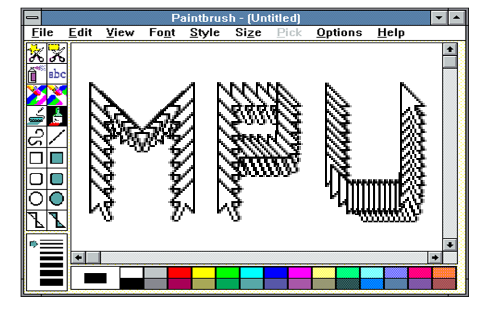
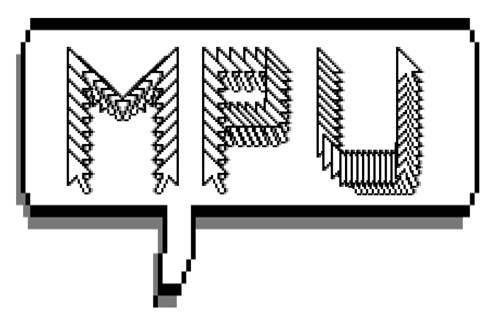
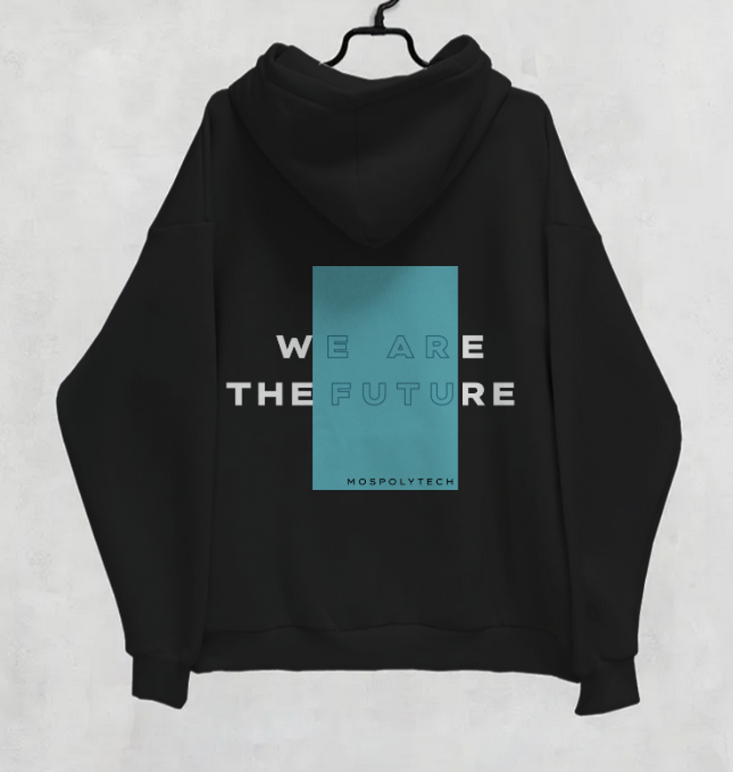
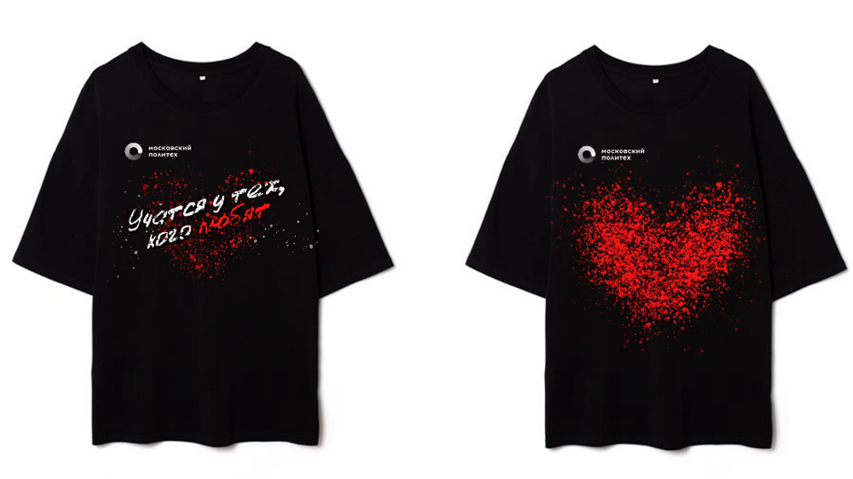
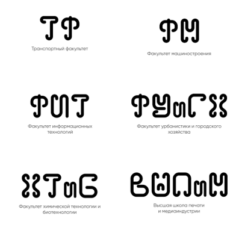
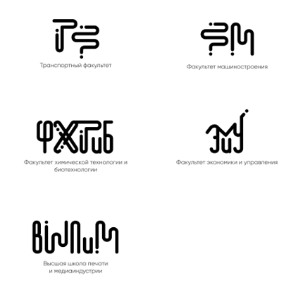

В течение проекта я участвовала в подпроекте Мерч Политеха. В начале составлялись мудборды (1 изображение), а затем по ним все участвующие в данном подпроекте придумывали концепции будущего мерча. Я создала прростой, но лакончиный дизайн футболки (2 изображение), а также дизайн значков (3-4 изображение). Далее участвовала в обсуждениях и правках всех предоставленных идей, как моих, так и участников, а также помогала создавать концепцию дизайна лого факультетов Мосполитеха.

